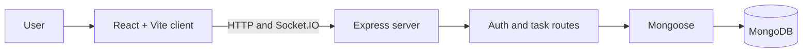

# Task Manager App

<p align="center"><strong>A React and Express task-management application, kept alongside several project snapshots and experiments in one repository.</strong></p>

<p align="center">React · Vite · Express · Socket.IO · MongoDB</p>

## Project overview

The top-level `client/` and `server/` folders form the task-manager application. The server is configured for MongoDB, JWT authentication, and Socket.IO. The repository also contains additional project folders and snapshots (including object counting, monitoring, and other app copies); these folders are not wired together as one application.

## Main app architecture



## Run the task manager

Use Node.js and MongoDB. From the repository root:

```bash
npm install
npm run install:all
```

Copy `server/.env.example` to `server/.env`, set `MONGODB_URI` and a long random `JWT_SECRET`, then run:

```bash
npm run dev
```

The root script starts the server and client together. The API defaults to port `5000`; the Vite client prints its own local URL. Never commit the real `server/.env` file.

## Scripts

- `npm run dev` — start the client and API
- `npm run build` — build the client
- `npm start` — start the API
- `npm run install:all` — install server and client dependencies

## Repository layout

- `client/` and `server/` — primary task-manager app
- `object-counting-project/` — separate Streamlit project
- Other top-level project-named folders — additional snapshots; inspect their own manifests before running

## Deployment and data

Configure the API URL, MongoDB connection, and secret values in the chosen hosting provider. The current app is designed around a separately running Express server and MongoDB; deploying only the static client is not sufficient. Review CORS, authentication, and production database settings before exposing real user data.
